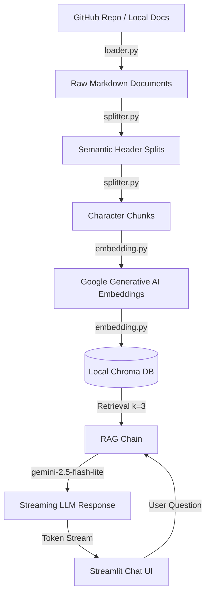

# 🤖 Multi-Query AI RAG Knowledge Assistant

An advanced **Retrieval-Augmented Generation (RAG)** pipeline designed to index, query, and chat with technical markdown documentation from GitHub repositories. This system leverages Google's Gemini models for embeddings and generative QA, stores vectorized chunks in ChromaDB, and features a responsive, streaming chat UI built with Streamlit.

This project was built to demonstrate modern RAG architecture practices, including semantic chunking, custom document loaders, vector store persistence, and streaming token delivery.

---

## 🛠️ Tech Stack & Architecture

*   **Orchestration:** LangChain (LCEL)
*   **LLM API:** Google Gemini (`gemini-2.5-flash-lite`)
*   **Embeddings:** Google AI Embeddings (`gemini-embedding-001`)
*   **Vector Database:** ChromaDB (Local Persisted Store)
*   **Frontend UI:** Streamlit (Custom Dark/Glassmorphism theme)
*   **Ingestion:** PyGithub (GitHub API wrapper)
*   **Package Manager:** uv (Modern, fast Python package installer)

---

## 💡 Key Architectural Details

### 1. Two-Pass Semantic Chunking (`module/splitter.py`)
To prevent information loss or paragraph truncation, this project uses a hierarchical two-stage chunking strategy:
*   **First Pass:** The `MarkdownHeaderTextSplitter` splits files along header boundaries (`#`, `##`, `###`). This preserves the structural context of the documentation.
*   **Second Pass:** A `RecursiveCharacterTextSplitter` runs on the header-split sections to ensure any chunk exceeding `1000` characters is broken down safely with overlap (`100` characters), optimizing retrieval quality.

### 2. Document Loader (`module/loader.py`)
Downloads `.md` files dynamically from target GitHub repositories using personal access tokens, converting them into standardized LangChain `Document` objects with rich metadata (file path, repo name, branch).

### 3. Vector Database Management (`module/embedding.py` & `module/check.py`)
Extracts and converts documents into embeddings, saving them to a local directory `./vector_db` with unique UUID-based identifiers to prevent overlapping namespace collisions.

### 4. LCEL Stream RAG Chain (`module/rag_chain.py`)
Built using **LangChain Expression Language (LCEL)**, composing the retriever, context formatter, prompt templates, and streaming-compatible LLMs into a unified pipeline.

---

## 🔍 Deep-Dive: Limitations of Naive RAG & Future Improvements

When building this project, a few key RAG limitations were analyzed:

### Why Global Questions (like "List all projects?") Fail
In Naive RAG, vector search relies on **semantic similarity** (finding chunks closest in meaning to the user query). 
1.  **Limited Window ($K$):** The system retrieved the top $K$ (e.g. 3) most relevant chunks. If you have 5 projects spread across 5 separate documents, a retriever fetching $3$ chunks cannot supply details for all 5.
2.  **No Global Intent Match:** A query like "list all projects" is mathematically dissimilar to the technical details inside each individual project file. It will fail to retrieve a uniform representation of all files.

### Solutions (Roadmap)
To transition this from a Naive RAG to an Advanced RAG system, the following features are planned:
*   [ ] **Parent-Document Retrieval:** Retrieve full documents when small chunks are matched, giving the LLM broader context.
*   [ ] **Reranking (Cohere/Cross-Encoder):** Fetch a larger list of chunks (e.g., $K=20$), then rank them with a cross-encoder model to supply the most relevant $3$ to the LLM.
*   [ ] **Multi-Query Expansion:** Feed the user query to a generator that translates it into multiple search prompts to maximize chunk retrieval recall.
*   [ ] **Agentic Routing:** For global summarization queries (e.g. "what is this repo?"), route to a map-reduce summarizer instead of standard vector similarity search.
